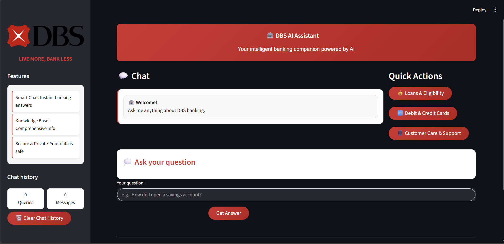
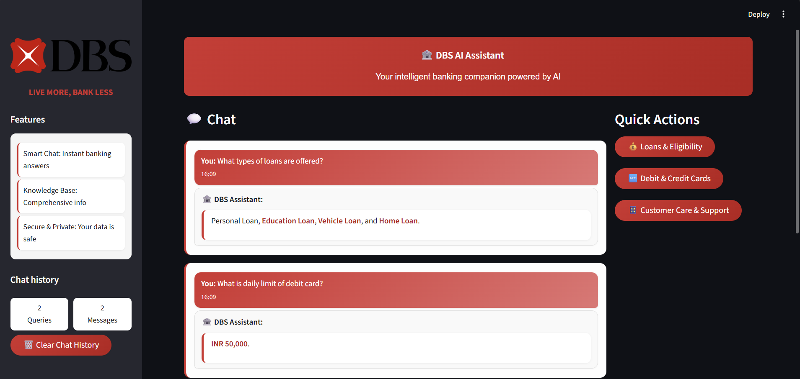

# DBS Customer Support AI Assistant 

An advanced **RAG (Retrieval-Augmented Generation) powered chatbot** designed to assist DBS customers by answering queries using official bank documents.  
The system uses **FAISS for semantic search**, **SentenceTransformers for embeddings**, and a **Flan-T5 model** for generating concise and safe responses.

---

##  Project Overview
  
*DBS Customer Support AI Assistant — example chat interface.*

  
*Another view of the assistant responding to a query.*

---

##  How RAG Works in This Project
1. **User Question** - A customer asks a banking-related query.  
2. **Embedding & Search** - The question is converted into embeddings and searched in **FAISS** against all document chunks.  
3. **Reranking** - A **CrossEncoder** model reranks the retrieved chunks for higher accuracy.  
4. **Context Building** - The most relevant parent chunks are selected as context.  
5. **LLM Response** - A **Flan-T5 model** generates the final answer using **only the retrieved context**.  
6. **Answer with Sources** - The assistant provides a concise reply along with document sources.  

 This ensures **accurate, document-grounded, and hallucination-free** customer support.

---

##  Features
-  Ingest and preprocess DBS policy/FAQ documents
-  Semantic search with **FAISS**
-  Cross-encoder reranking for higher accuracy
-  **Flan-T5** model for controlled answer generation
-  Provides **sources for transparency**
-  Refuses to answer if context is missing

---

##  Tech Stack
- **FastAPI** – API framework  
- **FAISS** – Vector database for semantic search  
- **SentenceTransformers** – Bi-encoder embeddings (`all-MiniLM-L6-v2`)  
- **CrossEncoder** – Reranker (`ms-marco-MiniLM-L-6-v2`)  
- **Transformers (Flan-T5)** – Generative model for final answers  
- **NLTK** – Sentence tokenization  

---

